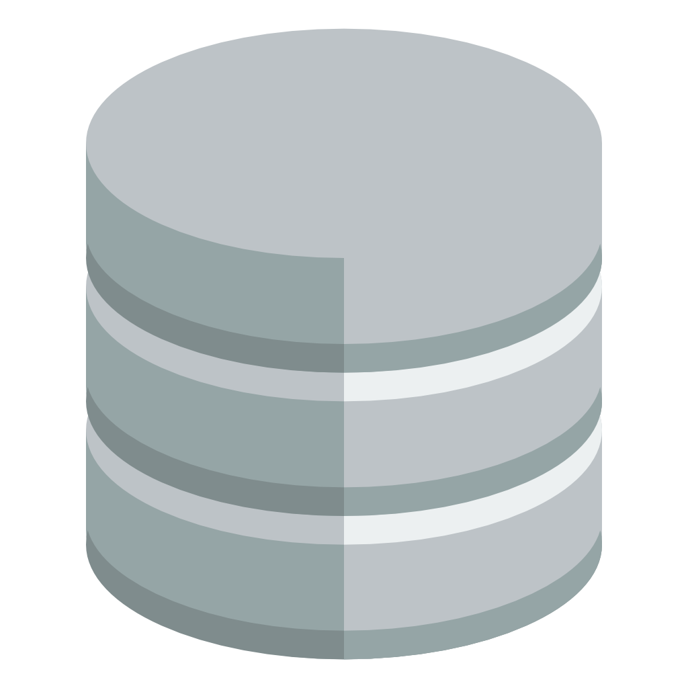

# Hi there 👋

### About me

A beginner engineer who is constantly striving to become better, to know more. Every day I work on my own projects, studying new technologies. Interested in Linux, DevOps, Back-end and Embedded (just hobby).

### Skills

### Projects

You can look at my projects by going to the [**portfolio**](https://github.com/dieisabel/portfolio),
or go to the [**Repositories**](https://github.com/dieisabel?tab=repositories) tab and see everything by yourself.

### Connect with me

